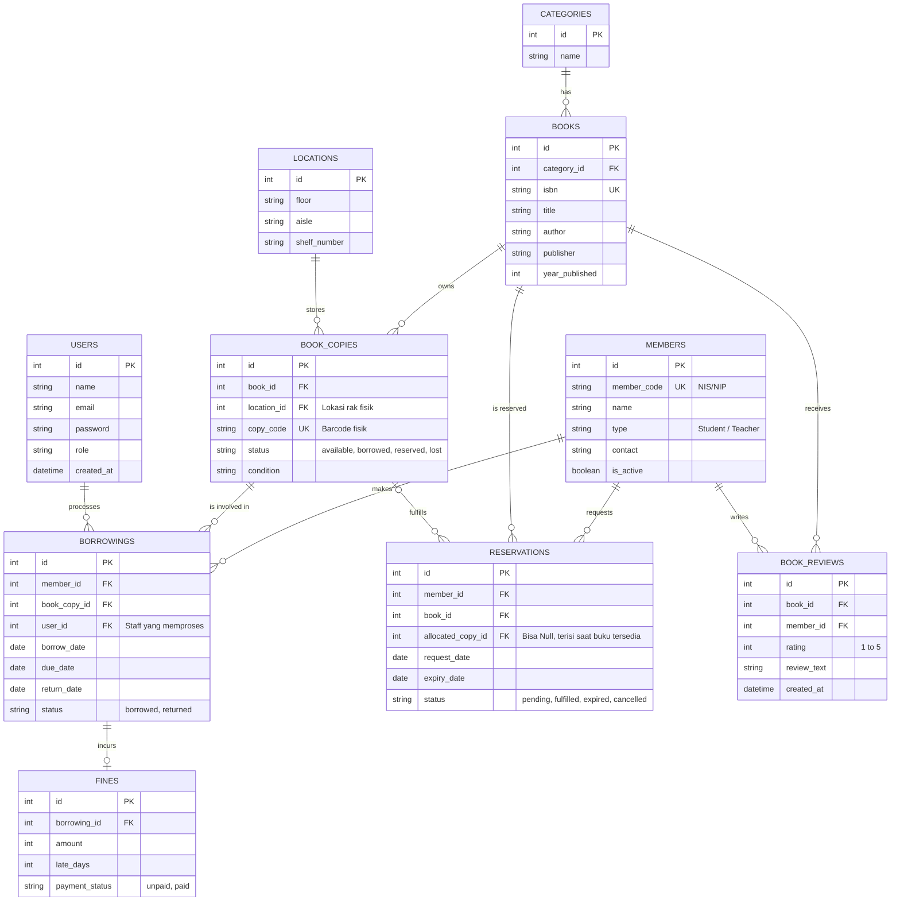

# Product Requirements Document (PRD): Aplikasi Perpustakaan Sekolah

**Dokumen Status:** Draft | **Target Pengguna:** Pustakawan, Siswa, Guru | **Pembuat:** Senior Product Manager & Tech Lead

---

## 1. Pendahuluan
Aplikasi Perpustakaan Sekolah ini bertujuan untuk mendigitalisasi dan mengotomatiskan seluruh proses operasional perpustakaan di sekolah. Dengan sistem ini, diharapkan proses pencarian buku, sirkulasi (peminjaman dan pengembalian), serta pelaporan dapat dilakukan dengan cepat, akurat, dan transparan.

## 2. Visi dan Objektif
- **Efisiensi Waktu:** Mempercepat proses peminjaman dan pengembalian melalui pelacakan sistematis.
- **Transparansi:** Menampilkan informasi ketersediaan buku dan riwayat peminjaman secara real-time.
- **Akurasi Data:** Mengurangi kesalahan *human error* dalam mencatat peminjaman dan perhitungan denda.

## 3. Cakupan Fitur Utama

### 3.1. Katalog Buku dengan Pencarian
- Sistem memiliki database katalog utama buku (metadata: ISBN, Judul, Pengarang, Penerbit, Tahun Terbit, Kategori/Genre, Sinopsis).
- Terdapat fitur pencarian *Advanced Search* bagi pengguna (berdasarkan Judul, Pengarang, atau Kategori).
- Pengguna dapat melihat detail buku beserta jumlah ketersediaan eksemplar di rak.

### 3.2. Manajemen Eksemplar Buku
- Satu entri katalog buku dapat memiliki banyak salinan fisik (eksemplar).
- Setiap eksemplar memiliki kode unik (ID/Barcode) dan status tersendiri (Tersedia, Dipinjam, Hilang, Rusak).
- Memudahkan pustakawan dalam *stock opname* dan melacak kondisi buku fisik.

### 3.3. Pendaftaran Anggota Perpustakaan
- Pencatatan data anggota yang mencakup Siswa dan Guru (Nomor Induk, Nama, Kelas/Jabatan, Kontak).
- Fitur pencetakan kartu anggota yang dilengkapi dengan barcode/QR code untuk kemudahan transaksi.
- Status keanggotaan dapat diaktifkan atau dinonaktifkan (misal: jika siswa sudah lulus).

### 3.4. Peminjaman dan Pengembalian Buku
- **Peminjaman:** Pustakawan melakukan scan kartu anggota dan barcode eksemplar buku. Sistem otomatis mencatat tanggal pinjam dan batas maksimal tanggal kembali. Terdapat validasi batas maksimal jumlah buku yang dipinjam.
- **Pengembalian:** Pustakawan melakukan scan barcode eksemplar buku. Sistem mencatat tanggal dikembalikan dan memperbarui status eksemplar menjadi "Tersedia".

### 3.5. Perhitungan Denda Otomatis
- Saat buku dikembalikan melewati batas waktu, sistem otomatis menghitung jumlah hari keterlambatan.
- Nominal denda diakumulasikan berdasarkan tarif per hari (contoh: Rp 500/hari/buku).
- Riwayat denda dan status pembayarannya (Lunas/Belum Lunas) akan tersimpan di profil anggota.

### 3.6. Reservasi Buku Otomatis
- Anggota dapat melakukan *booking* / reservasi secara mandiri (via portal anggota) untuk buku yang sedang dipinjam orang lain atau yang stoknya terbatas.
- Saat buku dikembalikan, sistem otomatis mengubah status buku menjadi "Direservasi" dan mengirimkan notifikasi/penanda kepada pustakawan bahwa buku tersebut dialokasikan untuk pemesan pertama (*First In First Out*).
- Terdapat batas waktu pengambilan reservasi (misal: 2x24 jam). Jika lewat, status kembali menjadi "Tersedia".

### 3.7. Laporan Koleksi dan Peminjaman
- **Dashboard Analitik:** Menyajikan grafik total buku, jumlah peminjaman bulan ini, dan pendapatan denda.
- **Laporan Peminjaman:** Laporan berkala (harian/bulanan/tahunan) yang bisa diekspor ke PDF/Excel.
- **Laporan Kinerja Buku:** Menampilkan buku terpopuler (paling sering dipinjam) dan daftar buku yang rusak/hilang.

---

## 4. Skema Data & Arsitektur (Naratif)

Arsitektur aplikasi akan menggunakan pola relasional. Berikut adalah penjelasan entitas utamanya:

1. **Users / Staff**: Mengelola data akses pengguna sistem (Pustakawan, Admin).
2. **Members**: Menyimpan data anggota perpustakaan (NIS/NIP, nama, tipe anggota, status).
3. **Categories**: Tabel master untuk kategori atau klasifikasi subjek buku.
4. **Books**: Tabel induk katalog yang menyimpan metadata buku (judul, ISBN, pengarang). Satu `Book` memiliki satu `Category`.
5. **Book_Copies (Eksemplar)**: Menyimpan item fisik. Berelasi langsung dengan `Books` dan `Locations`. Setiap `Book_Copy` memiliki `copy_code` unik, `location_id`, dan `status` (available, borrowed, reserved, lost, damaged).
6. **Borrowings**: Mencatat setiap transaksi peminjaman. Menautkan `Members` dengan `Book_Copies`. Menyimpan tanggal pinjam, batas kembali, dan tanggal aktual kembali.
7. **Fines**: Mencatat denda akibat keterlambatan. Berelasi dengan tabel `Borrowings`. Menyimpan nominal denda, jumlah hari terlambat, dan status pembayaran.
8. **Reservations**: Mencatat antrean reservasi buku. Menautkan `Members` dengan `Books` (bukan copy, agar saat copy mana pun kembali, bisa dialokasikan). Menyimpan tanggal *request*, tanggal kadaluarsa reservasi, dan status.
9. **Locations (Rak Buku)**: Tabel referensi yang menyimpan letak fisik rak buku (misal: Lantai 1, Lorong A, Rak 03) untuk memudahkan pencarian eksemplar fisik.
10. **Book_Reviews (Ulasan Buku)**: Menyimpan ulasan dan rating (bintang 1-5) yang diberikan oleh anggota perpustakaan terhadap buku yang pernah dipinjam.

---

## 5. Visualisasi Entity Relationship Diagram (ERD)

Diagram di bawah ini menggunakan sintaks Mermaid untuk memvisualisasikan relasi antarentitas dalam sistem perpustakaan.

---
**Catatan Teknis Tambahan:**
- *Trigger / Observer* dapat diimplementasikan di level aplikasi: Saat suatu `Borrowings` ditandai selesai (dikembalikan), sistem memeriksa `Reservations` yang *pending* pada `book_id` yang sama. Jika ada, `status` eksemplar diubah menjadi *reserved*, `allocated_copy_id` di reservasi diisi, dan *expiry_date* diset (misal: hari ini + 2 hari).
- *Cron Job / Scheduler* akan berjalan harian untuk mengecek `Borrowings` yang melewati *due_date* guna mengkalkulasi ulang denda, serta memeriksa `Reservations` yang sudah *expired* agar eksemplar kembali *available*.
